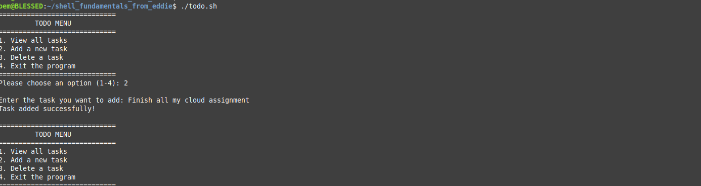
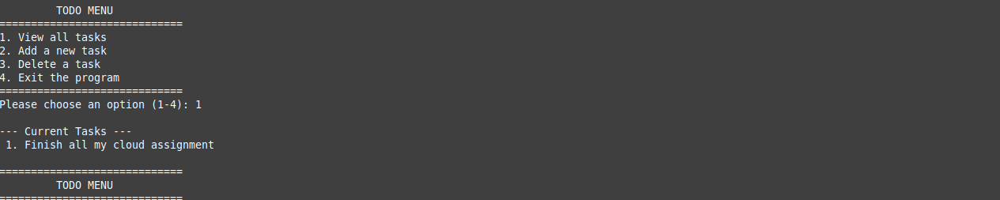
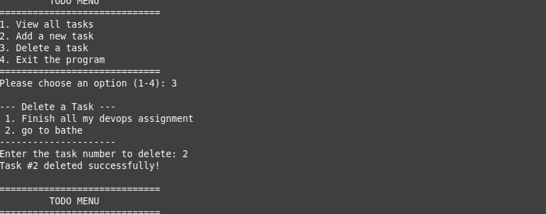

# shell_fundamentals_from_eddie


A simple, interactive Bash script to manage daily tasks directly from the terminal. This project demonstrates fundamental shell scripting concepts like loops, conditional statements, file I/O operations, and stream editing.

## How to Run the Script

1. Clone this repository or download `todo.sh`.
2. Give execution permissions to the script:
   ```bash
   chmod +x todo.sh
```




